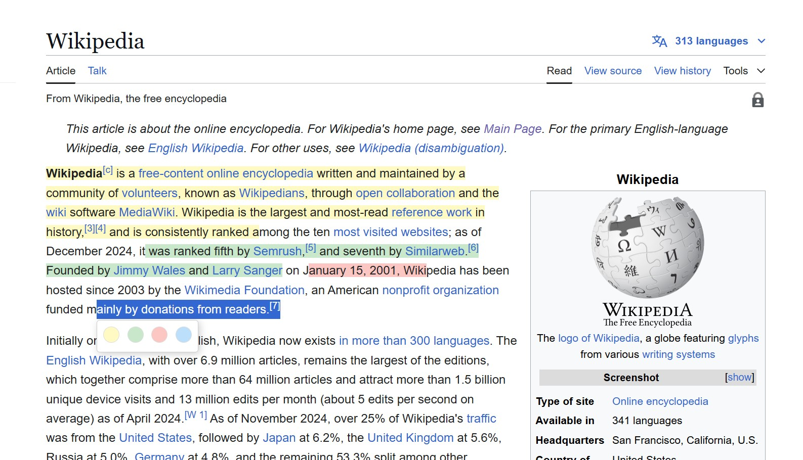

# Chrome Extension: Highlight Text

## Overview
This is a simple Chrome extension that allows you to highlight text on any webpage. All highlights are stored locally on your device, ensuring your privacy.

## Features
- Highlight text with different colors
- Save highlights across browser sessions
- Remove highlights with a single click
- Multiple color options
- Privacy-focused with local-only storage
- Optional error reporting for improvement

## Privacy
- All data is stored locally on your device
- No data is sent to external servers
- Optional error reporting (with explicit consent)
- View our full [Privacy Policy](PRIVACY.md)

## Limitations
The highlight storage and reload feature works on most websites but has some limitations:

### Works on:
- Static web pages
- Blog posts
- Documentation sites
- News articles
- Most content-based websites

### Limited or No Support:
The text storage and reload feature does not work on some websites or the selection over complex elements (including hyperlinks).

## How to install
1. Clone the repository
2. Go to chrome://extensions/
3. Click on "Load unpacked"
4. Select the "highlight-text" folder
5. Enjoy!

## Data & Privacy Controls
- Choose whether to enable error tracking during installation
- Export your highlights as text files
- Clear all stored data through extension menu
- All data is automatically removed on uninstall

## Contributing
Found a bug or want to suggest a feature? Please [open an issue](https://github.com/hackjutsu/text-highlighter/issues).

## License
[MIT License](LICENSE)

